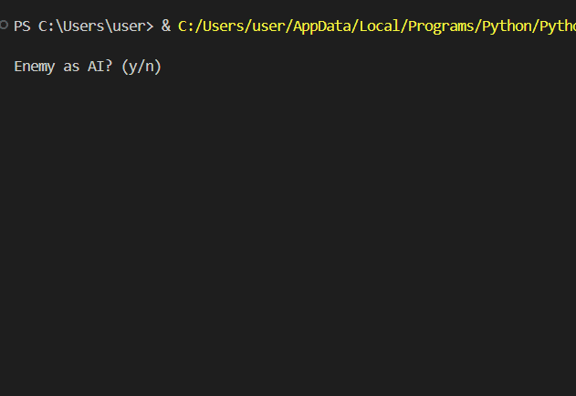

# 🎮 Tic Tac Toe (Python Console Version)

A simple **Python-based Tic Tac Toe game** played in the console.  
This project was created as a personal learning exercise to explore Python fundamentals such as **dictionaries**, **loops**, **functions**, and basic **AI logic** using random moves.

---

## 🧠 About the Project

This version of Tic Tac Toe uses a **dictionary-based board**, where each key represents a position on the 3×3 grid (like `"top-L"`, `"mid-M"`, etc.).  

You can play:
- 🧍 **Player vs Player**
- 💻 **Player vs Computer (Random AI)**

The computer uses random moves from available spaces — not strategic, but simple and effective for practice!

---

## ⚙️ Features

- Dictionary-based game board (`board = { 'top-L': ' ', ... }`)
- Player vs Player or Player vs Computer mode
- Input validation for occupied or invalid moves
- Automatic win detection for both X and O
- Detects ties (draws)
- Clean console-based interface

---

## 🕹️ How to Play

1. **Run the script**:
   ```bash
   python tictactoe.py
   ```

2. **Choose whether your opponent is **AI** (`y`) or another **player** (`n`)**.

3. **Use the following guide for choosing positions:**

   ```
   'top-L' | 'top-M' | 'top-R'
   --------+----------+---------
   'mid-L' | 'mid-M' | 'mid-R'
   --------+----------+---------
   'low-L' | 'low-M' | 'low-R'
   ```

4. **Take turns placing X and O until one player wins or all spaces are filled.**

---

## 📸 Demo

```markdown

```

---

## 💡 Learning Goals

This small project helped me practice:

* Python **functions** and **loops**
* Using **dictionaries** as data structures
* Basic **game logic** and **AI randomization**
* Writing **clean and readable** code
* Console-based input validation

---

## 🧩 File Structure

```
tictactoe/
├── main.py          # main source file
├── README.md             # project documentation
├── LICENSE               # MIT License 
└── screenshots/          # Demo GIF 
```

---

## 🔑 License

This project is licensed under the [MIT License](LICENSE).
You’re free to use, modify, and share it for learning purposes.

---

## 👤 Author

Loreen Wilmer Yboa

💼 Personal / Learning Project

📘 Exploring Python, Logic Building, and Console Applications

